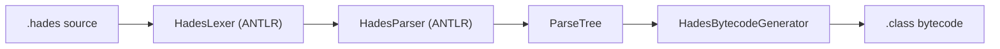

# Architecture

The compiler currently follows a direct parse-tree-to-bytecode path.

## Core Components

- `Main`: command-line entrypoint and file compilation dispatch.
- `HadesCompiler`: orchestration for lexing, parsing, and visiting.
- `HadesBytecodeGenerator`: ASM-based parse tree visitor that emits JVM bytecode.
- `Hades.g4`: grammar defining Hades language tokens and parser rules.

## Generated Reference Pages

The pages under **Reference** are generated automatically from repository sources by `scripts/generate_docs.py`.
