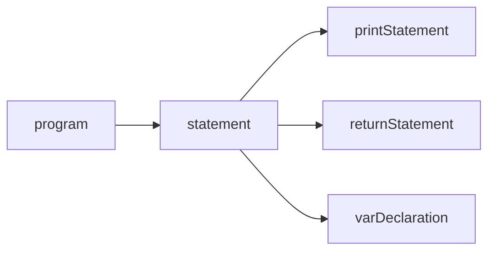

# ANTLR Grammar Reference

_This page is auto-generated from `src/main/antlr/Hades.g4` by `scripts/generate_docs.py`._

## Parser Rule Dependency Graph



## Parser Rules

| Rule | Definition |
| --- | --- |
| `program` | `statement+` |
| `statement` | `varDeclaration | printStatement | returnStatement` |
| `varDeclaration` | `HERO ID ASSIGN NUMBER SEMICOLON` |
| `printStatement` | `STYX ID SEMICOLON` |
| `returnStatement` | `BESTOW ID SEMICOLON` |

## Lexer Tokens

| Token | Definition |
| --- | --- |
| `HERO` | `'hero'` |
| `STYX` | `'styx'` |
| `BESTOW` | `'bestow'` |
| `ID` | `[a-zA-Z]+` |
| `NUMBER` | `[0-9]+` |
| `ASSIGN` | `'='` |
| `SEMICOLON` | `';'` |
| `WS` | `[ \t\r\n]+ -> skip` |

## Full Grammar

```antlr
grammar Hades;

// Lexer Rules
HERO: 'hero';           // Keyword to declare a variable
STYX: 'styx';           // Keyword to print a value
BESTOW: 'bestow';       // Keyword to return a value
ID: [a-zA-Z]+;          // Identifier for variables (e.g., 'a', 'variable')
NUMBER: [0-9]+;         // Numeric literals (e.g., '42')
ASSIGN: '=';
SEMICOLON: ';';
WS: [ \t\r\n]+ -> skip; // Whitespace (ignored)

// Parser Rules
program: statement+;    // A program consists of one or more statements

statement: varDeclaration    // Variable declaration
         | printStatement    // Print statement
         | returnStatement;  // Return statement

varDeclaration: HERO ID ASSIGN NUMBER SEMICOLON;    // hero a = 2;
printStatement: STYX ID SEMICOLON;                  // styx a;
returnStatement: BESTOW ID SEMICOLON;               // bestow a;
```
