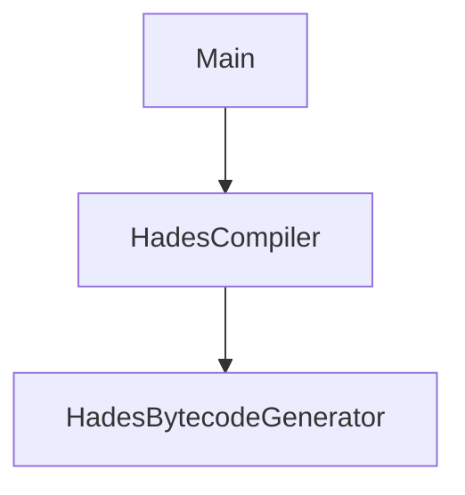

# Java Code Reference

_This page is auto-generated from `src/main/java` by `scripts/generate_docs.py`._

## Classes

| Class | Package | Source |
| --- | --- | --- |
| `HadesBytecodeGenerator` | `com.example` | `src/main/java/com/example/HadesBytecodeGenerator.java` |
| `HadesCompiler` | `com.example` | `src/main/java/com/example/HadesCompiler.java` |
| `Main` | `com.example` | `src/main/java/com/example/Main.java` |

## Class Dependency Graph



## Source Details

### `HadesBytecodeGenerator`

**Source:** `src/main/java/com/example/HadesBytecodeGenerator.java`

| Visibility | Return Type | Method | Parameters |
| --- | --- | --- | --- |
| `public` | `Void` | `visitVarDeclaration` | `HadesParser.VarDeclarationContext ctx` |
| `public` | `Void` | `visitPrintStatement` | `HadesParser.PrintStatementContext ctx` |
| `public` | `Void` | `visitReturnStatement` | `HadesParser.ReturnStatementContext ctx` |
| `public` | `byte[]` | `generateBytecode` | `()` |

```java
package com.example;

import org.objectweb.asm.ClassWriter;
import org.objectweb.asm.MethodVisitor;
import static org.objectweb.asm.Opcodes.ACC_PUBLIC;
import static org.objectweb.asm.Opcodes.ACC_STATIC;
import static org.objectweb.asm.Opcodes.ALOAD;
import static org.objectweb.asm.Opcodes.GETSTATIC;
import static org.objectweb.asm.Opcodes.ILOAD;
import static org.objectweb.asm.Opcodes.INVOKESPECIAL;
import static org.objectweb.asm.Opcodes.INVOKEVIRTUAL;
import static org.objectweb.asm.Opcodes.IRETURN;
import static org.objectweb.asm.Opcodes.ISTORE;
import static org.objectweb.asm.Opcodes.RETURN;
import static org.objectweb.asm.Opcodes.SIPUSH;
import static org.objectweb.asm.Opcodes.V1_8;

public class HadesBytecodeGenerator extends HadesBaseVisitor<Void> {
    private final ClassWriter classWriter;
    private final MethodVisitor methodVisitor;
    private int varCounter = 0;

    // Map to keep track of variable names and their corresponding indices
    private final java.util.Map<String, Integer> varMap = new java.util.HashMap<>();

    public HadesBytecodeGenerator() {
        // Set up ASM ClassWriter
        classWriter = new ClassWriter(ClassWriter.COMPUTE_FRAMES);
        classWriter.visit(V1_8, ACC_PUBLIC, "HadesProgram", null, "java/lang/Object", null);

        // Create default constructor
        MethodVisitor constructor = classWriter.visitMethod(ACC_PUBLIC, "<init>", "()V", null, null);
        constructor.visitCode();
        constructor.visitVarInsn(ALOAD, 0);
        constructor.visitMethodInsn(INVOKESPECIAL, "java/lang/Object", "<init>", "()V", false);
        constructor.visitInsn(RETURN);
        constructor.visitMaxs(1, 1);
        constructor.visitEnd();

        // Start the main method
        methodVisitor = classWriter.visitMethod(ACC_PUBLIC + ACC_STATIC, "main", "([Ljava/lang/String;)V", null, null);
        methodVisitor.visitCode();
    }

    @Override
    public Void visitVarDeclaration(HadesParser.VarDeclarationContext ctx) {
        String varName = ctx.ID().getText();
        int value = Integer.parseInt(ctx.NUMBER().getText());

        // Assign an index to the variable and store its value
        int index = varCounter++;
        varMap.put(varName, index);

        // Load the constant value and store it in the corresponding index
        methodVisitor.visitIntInsn(SIPUSH, value);
        methodVisitor.visitVarInsn(ISTORE, index);

        return null;
    }

    @Override
    public Void visitPrintStatement(HadesParser.PrintStatementContext ctx) {
        String varName = ctx.ID().getText();

        // Get the variable index and load it to be printed
        if (varMap.containsKey(varName)) {
            int index = varMap.get(varName);
            methodVisitor.visitFieldInsn(GETSTATIC, "java/lang/System", "out", "Ljava/io/PrintStream;");
            methodVisitor.visitVarInsn(ILOAD, index);
            methodVisitor.visitMethodInsn(INVOKEVIRTUAL, "java/io/PrintStream", "println", "(I)V", false);
        } else {
            throw new RuntimeException("Variable " + varName + " is not defined.");
        }

        return null;
    }

    @Override
    public Void visitReturnStatement(HadesParser.ReturnStatementContext ctx) {
        String varName = ctx.ID().getText();

        // Get the variable index and return its value
        if (varMap.containsKey(varName)) {
            int index = varMap.get(varName);
            methodVisitor.visitVarInsn(ILOAD, index);
            methodVisitor.visitInsn(IRETURN);
        } else {
            throw new RuntimeException("Variable " + varName + " is not defined.");
        }

        return null;
    }

    public byte[] generateBytecode() {
        // End the main method
        methodVisitor.visitInsn(RETURN);
        methodVisitor.visitMaxs(2, varCounter);
        methodVisitor.visitEnd();

        classWriter.visitEnd();

        // Return the generated bytecode
        return classWriter.toByteArray();
    }
}
```

### `HadesCompiler`

**Source:** `src/main/java/com/example/HadesCompiler.java`

| Visibility | Return Type | Method | Parameters |
| --- | --- | --- | --- |
| `public` | `byte[]` | `generateBytecode` | `String input` |

```java
package com.example;

import org.antlr.v4.runtime.CharStream;
import org.antlr.v4.runtime.CharStreams;
import org.antlr.v4.runtime.CommonTokenStream;
import org.antlr.v4.runtime.tree.ParseTree;

public class HadesCompiler {

    public byte[] generateBytecode(String input) throws Exception {
        // Create a CharStream that reads from the input string
        CharStream charStream = CharStreams.fromString(input);

        // Create a lexer that feeds off of the char stream
        HadesLexer lexer = new HadesLexer(charStream);

        // Create a token stream from the lexer
        CommonTokenStream tokens = new CommonTokenStream(lexer);

        // Create a parser that feeds off of the token stream
        HadesParser parser = new HadesParser(tokens);

        // Begin parsing at the `program` rule
        ParseTree tree = parser.program();

        // Print out the parse tree for debugging purposes
        System.out.println(tree.toStringTree(parser));

        // Visit the parse tree to generate bytecode
        HadesBytecodeGenerator bytecodeGenerator = new HadesBytecodeGenerator();
        bytecodeGenerator.visit(tree);

        return bytecodeGenerator.generateBytecode();
    }
}
```

### `Main`

**Source:** `src/main/java/com/example/Main.java`

| Visibility | Return Type | Method | Parameters |
| --- | --- | --- | --- |
| `public` | `void` | `main` | `String[] args` |
| `private` | `String` | `readFileContents` | `File file` |
| `private` | `void` | `execute` | `CommandLine cmd` |
| `private` | `void` | `compile` | `File file` |

```java
package com.example;

import java.io.File;
import java.io.FileOutputStream;
import java.io.IOException;
import java.nio.charset.StandardCharsets;
import java.nio.file.Files;

import org.apache.commons.cli.CommandLine;
import org.apache.commons.cli.CommandLineParser;
import org.apache.commons.cli.DefaultParser;
import org.apache.commons.cli.HelpFormatter;
import org.apache.commons.cli.Options;
import org.apache.commons.cli.ParseException;

public class Main {

    public static void main(String[] args) throws Exception {
        Options options = new Options();
        options.addOption("h", "help", false, "Show help");
        options.addRequiredOption("i", "input", true, "Input .hades file or directory");

        CommandLineParser parser = new DefaultParser();
        HelpFormatter formatter = new HelpFormatter();

        try {
            // Parse the command-line arguments
            CommandLine cmd = parser.parse(options, args);

            // If the user asks for help, display it and exit
            if (cmd.hasOption("h")) {
                formatter.printHelp("HadesCompiler", options);
                System.exit(0);
            }

            execute(cmd);
        } catch (ParseException e) {
            System.out.println(e.getMessage());
            formatter.printHelp("HadesCompiler", options);
            System.exit(1);
        }
    }

    private static String readFileContents(File file) throws IOException {
        // Read all lines from the file and convert them to a string
        String content = new String(Files.readAllBytes(file.toPath()), StandardCharsets.UTF_8);
        return content;
    }

    private static void execute(CommandLine cmd) throws Exception {
        File file = new File(cmd.getOptionValue("f"));
        compile(file);
    }

    private static void compile(File file) throws Exception {
        if (file.isDirectory()) {
            File[] files = file.listFiles();
            if (files != null) {  // Check if the directory is not empty or accessible
                for (File childFile : files) {
                    if (childFile.isFile()) {
                        compile(file);
                    }
                }
            }
        } else {

            // Check if the file has a .hades extension
            if (!file.getName().endsWith(".hades")) {
                System.out.println("Error: The file must have a .hades extension.");
                System.exit(1);
            }

            // Remove the .hades extension and replace it with .class
            String classFilePath = file.getAbsolutePath().substring(0, file.getAbsolutePath().length() - 6) + ".class";

            // Read the contents of the .hades file
            String input = readFileContents(file);

            // Generate bytecode (assuming the HadesCompiler class exists)
            byte[] bytecode = new HadesCompiler().generateBytecode(input);

            // Write the bytecode to a .class file
            try (FileOutputStream fos = new FileOutputStream(classFilePath)) {
                fos.write(bytecode);
                System.out.println("Class file created: " + classFilePath);
            } catch (IOException e) {
                System.out.println("Error writing to class file: " + e.getMessage());
            }
        }
    }
}
```

