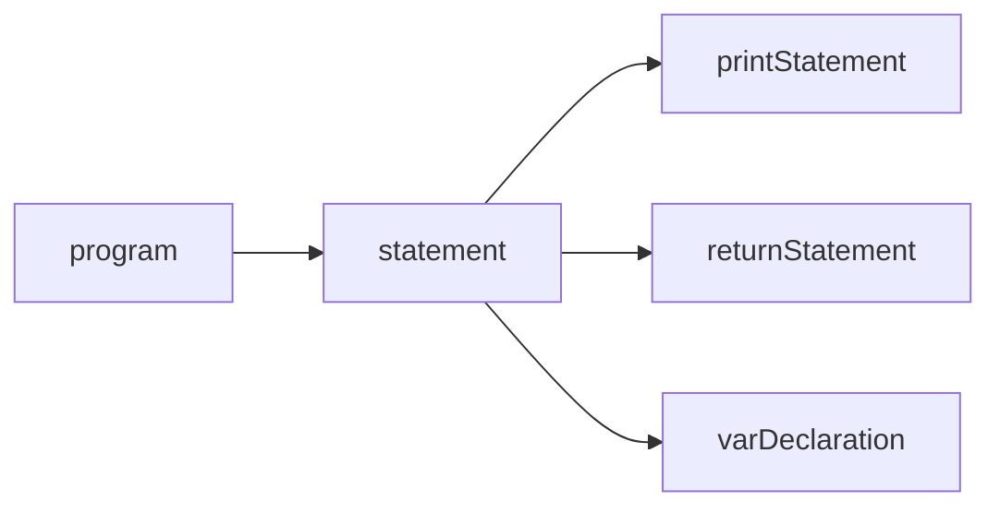
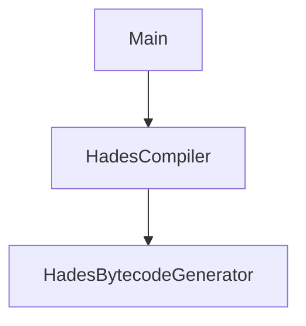
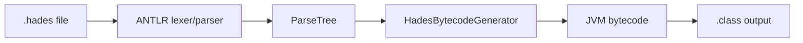

# Generated Diagrams

_This page is auto-generated from grammar and Java source relationships._

## Grammar Relationships

```mermaid
flowchart LR
  printStatement["printStatement"]
  program["program"]
  returnStatement["returnStatement"]
  statement["statement"]
  varDeclaration["varDeclaration"]
  program --> statement
  statement --> printStatement
  statement --> returnStatement
  statement --> varDeclaration
```

## Java Class Relationships

```mermaid
flowchart TD
  HadesBytecodeGenerator["HadesBytecodeGenerator"]
  HadesCompiler["HadesCompiler"]
  Main["Main"]
  HadesCompiler --> HadesBytecodeGenerator
  Main --> HadesCompiler
```

## Build Pipeline

```mermaid
flowchart LR
  source[".hades file"] --> parser["ANTLR lexer/parser"]
  parser --> tree["ParseTree"]
  tree --> visitor["HadesBytecodeGenerator"]
  visitor --> bytecode["JVM bytecode"]
  bytecode --> classfile[".class output"]
```
